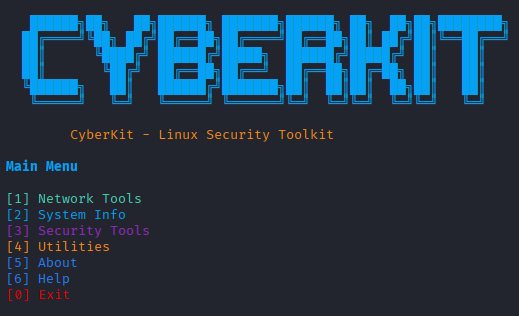

🔐 CyberKit – Linux Security Toolkit

CyberKit is a modular Linux security toolkit developed for educational and academic purposes.
It provides a collection of system, network, and security utilities designed to help students understand core cybersecurity concepts in a safe and non-offensive manner.

🎯 Project Objectives

Learn how to build a modular security tool using Python

Understand system, network, and security fundamentals

Practice secure coding and ethical security principles

Apply real Linux commands through Python automation

🧩 Features & Modules
🌐 Network Tools

MAC Address Changer

Ping Tool

🖥️ System Information

OS & Kernel Information

CPU & RAM Information

Disk Usage

Logged-in Users

🔐 Security Tools

Open Ports Checker (Local)

Running Services Checker

Firewall Status Checker

Password Strength Checker

🧰 Utilities

Random Password Generator

Hash Generator (MD5 / SHA256)
## 📸 Screenshot

📂 Project Structure
cyberkit/
│
├── main.py
├── menu.py
│
├── network/
│   ├── mac_changer.py
│   └── ping_tool.py
│
├── system/
│   ├── os_kernel_info.py
│   ├── cpu_ram_info.py
│   └── disk_usage.py
│    
├── security/
│   ├── open_ports.py
│   ├── running_services.py
│   └── password_strength.py
│
└── utils/
    ├── colors.py
    ├── banner.py
    ├── password_generator.py
    ├── hash_generator.py
    ├── about.py
    └── help.py

▶️ How to Run
git clone https://github.com/ywhabach/CyberKit
cd CyberKit
python3 main.py

⚠️ Some network tools may require sudo privileges:

sudo python3 main.py

🎨 Interface

Color-coded menus for better readability

Modular design (each tool is independent)

Clear output with meaningful symbols

⚠️ Disclaimer

This project is developed for educational purposes only.
It does NOT perform offensive or illegal actions.
The author is not responsible for any misuse of this tool.

👨‍💻 Author

Name: Osama Al-Matari,aiman moejip,Ahmed alsanabani,Naif Alahmadi,Abdalhameed Alobadi

Field: Cybersecurity Students

Purpose: Academic Project

⭐ Notes

If you like this project or find it useful, feel free to ⭐ the repository.